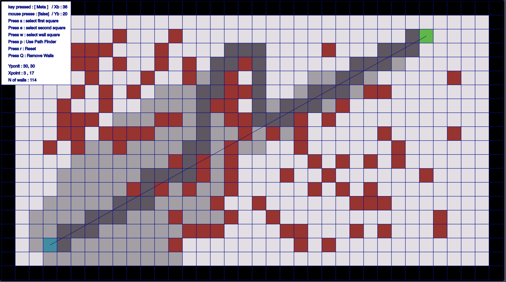
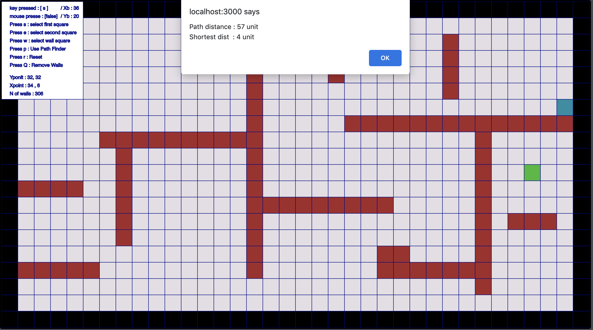
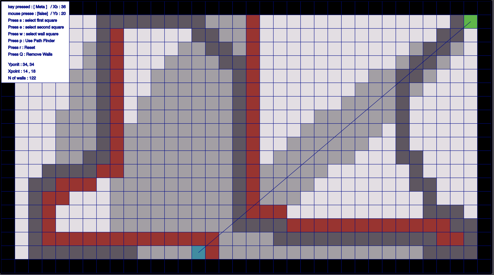
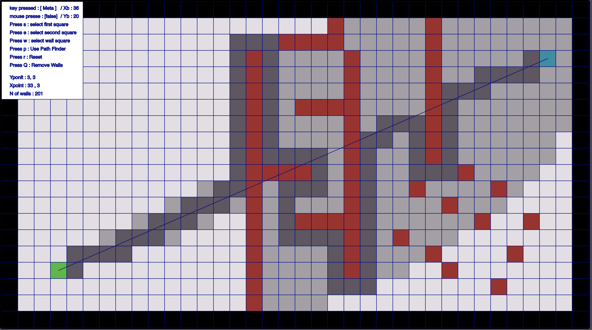
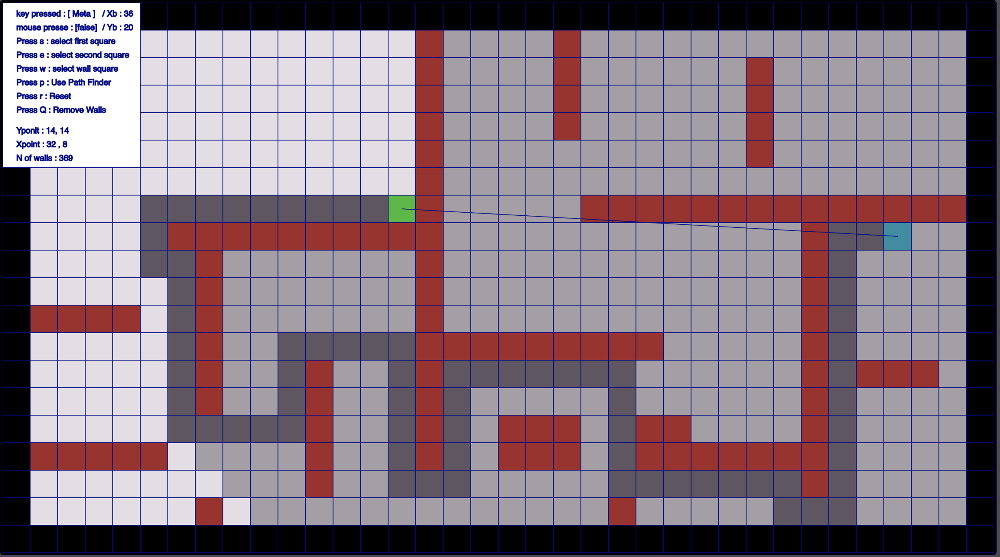
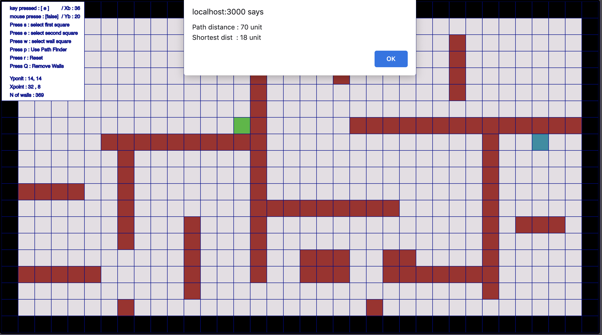

# Path Finder — A* visualiser (React + p5.js)

An interactive grid that animates A* search between two points. The cost function adds a **turn penalty**, so among equally short routes it prefers paths with fewer turns. You draw walls, place start and end, and watch the open and closed sets grow cell by cell.

<p align="center"> </p>

## How it works

- **Search:** A* with Euclidean `g` (distance from start) and `h` (distance to goal).
- **Turn penalty:** when a step changes direction relative to the parent's heading, `g` gets an extra `2 × cell size`. This pushes the search toward straight, low-turn routes, which suit robots and vehicles better than zig-zag shortest paths.
- **Rendering:** a p5.js sketch embedded in React (`react-p5`) draws the grid, visited cells and the final path every frame.

## Controls

| Key | Action |
|---|---|
| `s` | Place the start cell |
| `e` | Place the end cell |
| `w` | Draw walls |
| `p` | Run the search |
| `r` | Reset the board, keeping walls |
| `q` | Clear all walls |

Legend: blue = start · green = end · brown = wall · grey = explored · black line = chosen path.

## Run it

```bash
git clone https://github.com/Alcheemiist/PathFinderAlgorithmeP5.git
cd PathFinderAlgorithmeP5
npm install
npm start            # http://localhost:3000
```

## More demos

<p align="center">
 
 
</p>

Stack: TypeScript · React 18 · p5.js (`react-p5`) · styled-components.

---

Built by [Elmahdi Elaazmi](https://elaazmielmahdi.com).
